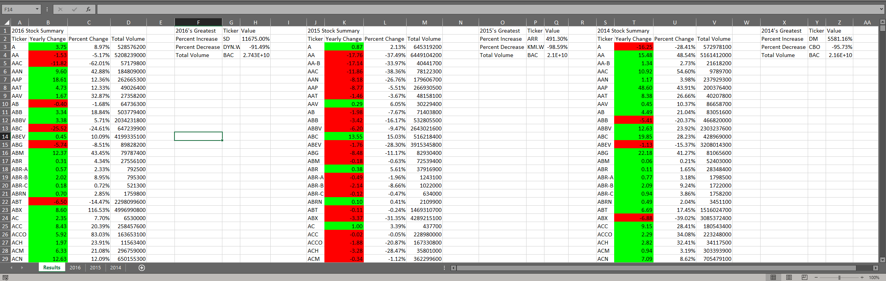

# Sample Stock Analysis

VBA scripts for analyzing statistics on sample stock data

## Files

### [Stock.cls](Stock.cls)

VBA class for storing opening and closing information for a given Stock

### [StockAnalysis.bas](StockAnalysis.bas)

VBA Sub Module for systematically checking the total gains/losses/volume of stock exchanges in a workbook.  
Outputs results in new sheet in front of workbook

### [Multiple_year_stock_data.xlsm](Multiple_year_stock_data.xlsm)

Macro enabled Excel workbook with sample data to test StockAnalysis

### [Results.png](Results.png)

Screencapture of Results page after running StockAnalysis on Multiple_year_stock_data.xlsm

### [Testdata.xlsm](testdata.xlsm)

Macro enabled Excel workbook with very small/poor sample data for quick debugging of StockAnalysis
